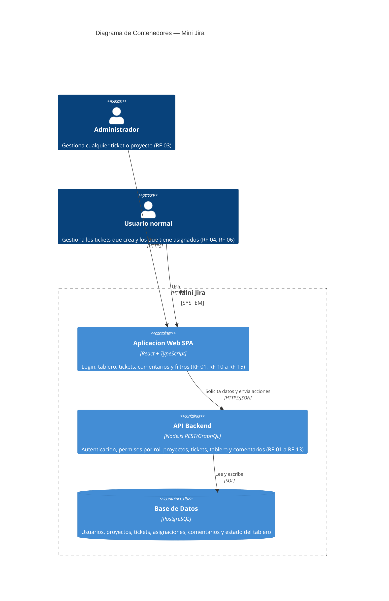
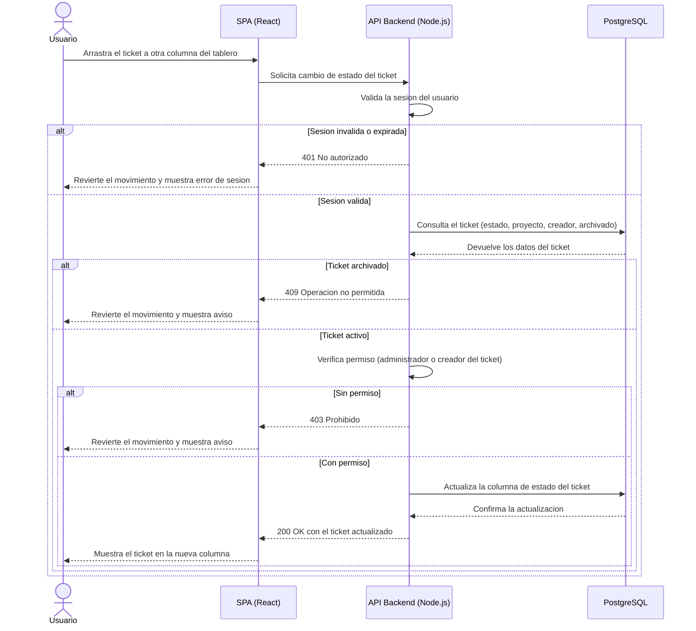

# architecture.md — Mini Jira

Arquitectura derivada exclusivamente de `docs/specs.md` (stack tecnológico y requerimientos funcionales) y `docs/backlog.md` (historias de usuario). No se incluyen servicios, colas, cachés ni integraciones que no estén explícitamente en specs.md.

## 1. Modelo C4 — Nivel de Contenedores (HLD)

Contenedores derivados 1:1 del stack definido en specs.md (§ "Stack Tecnológico"):

- **Aplicación Web (SPA)** — React + TypeScript. Única interfaz de usuario (login, tickets, tablero, comentarios, filtros).
- **API Backend** — Node.js con API REST/GraphQL. Concentra toda la lógica de negocio: autenticación, permisos por rol (RF-02 a RF-04), proyectos, tickets, tablero y comentarios. No se modela un servicio de autenticación separado porque specs.md solo confirma login de "usuarios registrados en la aplicación" (RF-01) sin integración externa confirmada (Supuesto `[PENDIENTE]`).
- **Base de datos PostgreSQL** — Almacena usuarios, proyectos, tickets, asignaciones y comentarios (specs.md § Stack Tecnológico, línea 30: "elegida para modelar relaciones entre proyectos, tickets y usuarios").

Dos actores (`Person`) porque RF-02/RF-03/RF-04 definen permisos distintos entre administrador y usuario normal.

## 2. Diagrama de Secuencia — LLD

Historia más representativa del backlog: **HU-09, "Mover un ticket entre columnas del tablero"** (`docs/backlog.md`, RF-11/RF-12). Se eligió porque el tablero es la interacción central de la herramienta y su flujo obliga a atravesar las tres capas junto con las reglas de negocio de otras historias ya definidas en specs.md:

- Antes de mover el ticket, no debe estar archivado (RF-09, y el edge case "Intento de mover un ticket archivado en el tablero" de `docs/backlog.md`).
- Mover un ticket es una forma de editarlo, por lo que aplica la misma regla de permisos de RF-03/RF-04 (administrador, o el usuario normal que lo creó).

## 3. Notas de trazabilidad

- Ningún contenedor ni participante fue inventado: la SPA, la API y PostgreSQL provienen directamente de `docs/specs.md` § "Stack Tecnológico".
- El diagrama de secuencia combina RF-11, RF-12 (tablero), RF-09 (archivado) y RF-03/RF-04 (permisos), todos ya presentes en `docs/specs.md` y `docs/backlog.md`.
- La estrategia de concurrencia (dos usuarios moviendo el mismo ticket a la vez) sigue marcada `[PENDIENTE]` en specs.md; el diagrama de secuencia modela una única solicitud y no resuelve ese punto pendiente.
