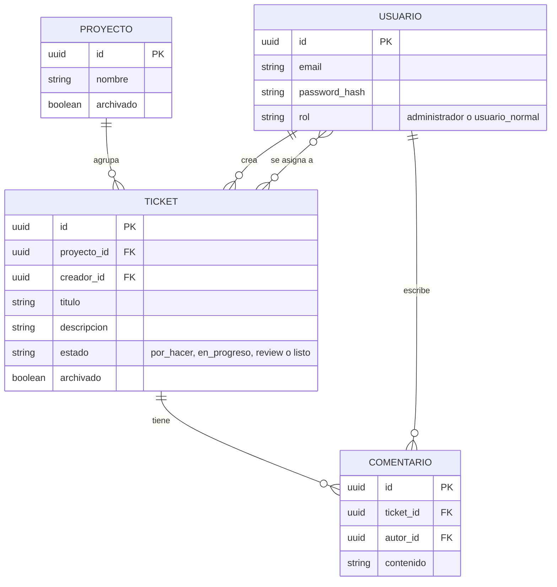

# er_diagram.md — Mini Jira

Modelo entidad-relación derivado exclusivamente de `docs/specs.md`. Toda entidad, atributo y relación está justificada por un RF concreto (ver tabla de trazabilidad, § 2). No se generan sentencias SQL en este documento.

## 1. Diagrama ER

## 2. Trazabilidad a specs.md

| Elemento | Tipo | RF que lo justifica |
|---|---|---|
| USUARIO | Entidad | RF-01 (login de usuarios registrados), RF-02 (existencia de roles) |
| USUARIO.email | Atributo | RF-01 — identificador mínimo necesario para "login de usuarios registrados" |
| USUARIO.password_hash | Atributo | RF-01 — credencial mínima necesaria para el login |
| USUARIO.rol | Atributo | RF-02 — "deben existir dos roles: administrador y usuario normal" |
| PROYECTO | Entidad | RF-05 (agrupamiento de tickets), RF-06 (visibilidad por proyecto) |
| PROYECTO.nombre | Atributo | RF-05 — un proyecto debe ser distinguible para poder agrupar tickets bajo él |
| PROYECTO.archivado | Atributo | RF-03 — el administrador puede "archivar cualquier ticket **o proyecto**" |
| TICKET | Entidad | RF-07, RF-09, RF-11, RF-12 |
| TICKET.titulo | Atributo | RF-07 — "un ticket debe tener al menos los campos: título y descripción larga" |
| TICKET.descripcion | Atributo | RF-07 (ídem) |
| TICKET.estado | Atributo | RF-11 (4 columnas: Por hacer, En progreso, Review, Listo) y RF-12 (un ticket se mueve entre columnas) |
| TICKET.archivado | Atributo | RF-09 — "Eliminar" no borra físicamente, archiva |
| TICKET.creador_id (FK → USUARIO) | Atributo | RF-04 — necesario para saber si "él mismo lo creó" y aplicar el permiso |
| TICKET.proyecto_id (FK → PROYECTO) | Atributo | RF-05 — los tickets deben agruparse por proyecto |
| COMENTARIO | Entidad | RF-13 — "un usuario debe poder añadir comentarios dentro de un ticket" |
| COMENTARIO.contenido | Atributo | RF-13 (contenido del comentario) |
| COMENTARIO.ticket_id (FK → TICKET) | Atributo | RF-13 — el comentario vive "dentro de un ticket" |
| COMENTARIO.autor_id (FK → USUARIO) | Atributo | RF-13 — es "un usuario" quien añade el comentario |
| USUARIO ⟶ TICKET : "crea" | Relación (1:N) | RF-04 (autoría del ticket) y RF-03 (el admin también crea) |
| PROYECTO ⟶ TICKET : "agrupa" | Relación (1:N) | RF-05 (agrupamiento de tickets por proyecto) |
| USUARIO ⟷ TICKET : "se asigna a" | Relación (N:M) | RF-08 — "un ticket debe poder asignarse a una o más personas" |
| TICKET ⟶ COMENTARIO : "tiene" | Relación (1:N) | RF-13 |
| USUARIO ⟶ COMENTARIO : "escribe" | Relación (1:N) | RF-13 |

## 3. Decisiones de modelado y exclusiones deliberadas

- **No existe una entidad "Rol"**: RF-02 define un conjunto fijo y cerrado de dos roles (administrador, usuario normal), sin atributos propios descritos en specs.md. Se modela como el atributo enumerado `USUARIO.rol`, no como una tabla independiente.
- **No existe una entidad "Columna" o "Estado"**: RF-11 define un conjunto fijo y cerrado de 4 estados de tablero, sin atributos propios (no se describen, por ejemplo, límites de WIP por columna). Se modela como el atributo enumerado `TICKET.estado`.
- **No existe una entidad "Asignación"**: RF-08 solo exige que un ticket pueda asignarse a una o más personas; specs.md no describe ningún atributo propio de ese vínculo (fecha de asignación, quién asignó, etc.). Se modela como relación N:M directa entre `USUARIO` y `TICKET`.
- **`PROYECTO` no tiene `creador_id`**: specs.md marca explícitamente como `[PENDIENTE]` quién puede crear proyectos (línea 41). No hay un RF confirmado que exija registrar la autoría de un proyecto, a diferencia de `TICKET.creador_id`, que sí está respaldado por RF-04. Se revisará cuando ese pendiente se cierre.
- **Cardinalidad `PROYECTO`–`TICKET` modelada como 1:N** (un ticket pertenece a un único proyecto): sigue el supuesto vigente en specs.md (línea 40), el cual está marcado `[PENDIENTE]`. Si se confirma que un ticket puede pertenecer a varios proyectos, esta relación deberá pasar a N:M.
- **`TICKET` no incluye prioridad, etiquetas ni fecha límite**: specs.md marca esos campos explícitamente como `[PENDIENTE]` (línea 38). Se añadirán como atributos cuando se confirmen.
- **`RF-06` (visibilidad de proyectos por asignación) no genera una relación propia**: se resuelve como una consulta derivada del recorrido `USUARIO —(se asigna a)— TICKET —(agrupa)— PROYECTO` ya modelado, sin necesitar una relación directa `USUARIO`–`PROYECTO`.
- **No se incluyen campos de auditoría** (fecha de creación/actualización) ni mecanismos de concurrencia: specs.md marca la estrategia de edición concurrente como `[PENDIENTE]` (línea 36); cualquier campo de esa naturaleza se añadirá cuando se resuelva ese punto, para no anticipar una solución (last-write-wins, bloqueo o merge) que el PO todavía no ha decidido.
- **No se genera SQL** en este documento; este ERD es el insumo conceptual para el esquema físico (tablas, tipos exactos, índices) que se definirá en un artefacto posterior, una vez resueltos los pendientes de specs.md que aún afectan el modelo (líneas 34, 36–41).
